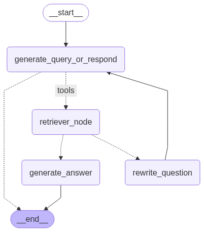

# FastAPI RAG System

A production-ready FastAPI RAG (Retrieval-Augmented Generation) system with an agentic RAG implementations using LangGraph, and memory to support multi-turn conversations.

**LangGraph:**

This LangGraph has 3 main steps
(1) decide whether to answer based on the full conversation history or to retrieve content from the vector store;
(2) retrieve content and judge wheter that content is relevant to answer the question;
(3) if content is irrelevant, try to adjust the retrieval prompt.



## Features

- **Document Ingestion**: Ingest documents from URLs with automatic chunking and embedding using BeautifulSoup
- **Dual RAG Modes**:
  - **Traditional RAG**: Query analysis → retrieval → generation pipeline
  - **Agentic RAG**: Self-correcting RAG with document grading and query rewriting
- **Structured Logging**: Comprehensive logging with structlog
- **API Documentation**: Auto-generated OpenAPI/Swagger documentation
- **Graph Visualization**: Automatic generation of LangGraph pipeline visualizations

## Architecture

```
agentic-rag/
├── app/
│   ├── __init__.py
│   ├── main.py                # FastAPI application entry point
│   ├── app.py                 # Gradio application starter
│   ├── core/
│   │   ├── config.py          # Configuration management with Pydantic Settings
│   │   ├── logging.py         # Structured logging configuration
│   │   └── prompts.py         # LLM prompt templates
│   ├── models/
│   │   ├── requests.py        # Pydantic request models
│   │   └── responses.py       # Pydantic response models
│   ├── services/
│   │   ├── llm_service.py     # LLM and embeddings management
│   │   ├── document_service.py # Document ingestion and storage
│   │   ├── rag_service.py     # Traditional RAG pipeline with LangGraph
│   │   ├── rag_service_agentic.py # Agentic RAG pipeline with LangGraph
│   │   ├── vector_store_factory.py # Vector store factory pattern
│   │   └── graphs/            # Generated LangGraph visualizations
│   │       ├── graph_nonagentic.png
│   │       └── graph_agentic.png
│   ├── api/
│   │   ├── deps.py            # Dependency injection
│   │   └── v1/
│   │       ├── api.py         # API router aggregation
│   │       └── endpoints/
│   │           ├── health.py   # Health check endpoints
│   │           ├── documents.py # Document management endpoints
│   │           └── query.py    # RAG query endpoints (both modes)
│   └── utils/
│       └── helpers.py         # Utility functions
├── requirements.txt           # Python dependencies
├── sandbox.ipynb            # Development notebook
└── explore/                 # Exploration and testing files
```

## Installation

1. Install dependencies:

```bash
pip install -r requirements.txt
```

2. Set up environment variables:
   Create a `.env` file with the following variables:

```bash
# OpenAI Configuration (Required)
OPENAI_API_KEY=your_openai_api_key_here

# Application Configuration (Optional)
DEBUG=false
LOG_LEVEL=INFO
HOST=0.0.0.0
PORT=8000

# LLM Configuration (Optional)
OPENAI_MODEL=gpt-4o-mini
EMBEDDING_MODEL=text-embedding-ada-002

# RAG Configuration (Optional)
CHUNK_SIZE=1000
CHUNK_OVERLAP=200
MAX_DOCS_RETRIEVAL=4
VECTOR_STORE_TYPE=in_memory
```

## Usage

### Running the Application

```bash
# Using the module syntax (recommended)
python -m app.main

# Or directly
python app/main.py
```

The application will start on `http://localhost:8000`

### API Documentation

- Swagger UI: `http://localhost:8000/docs`
- ReDoc: `http://localhost:8000/redoc`

## Technology Stack

- **FastAPI**: Modern, fast web framework for building APIs
- **LangChain**: Framework for developing applications with LLMs
- **LangGraph**: Library for building stateful, multi-actor applications with graphs
- **OpenAI**: LLM and embedding models (GPT-4o-mini, text-embedding-ada-002)
- **Pydantic**: Data validation and settings management
- **Structlog**: Structured logging
- **BeautifulSoup**: HTML parsing for web scraping with CSS class filtering
- **Vector Store Factory**: Configurable vector storage backends (InMemory, Chroma, FAISS)

## Current Limitations

- **Limited Document Embedding**: URL scraping limited by our sample (target) HTML structure
- **Vector Store Persistence**: Default in-memory storage loses data on restart
- **Document Deletion**: Limited support varies by vector store implementation
- **Content Extraction**: Currently optimized for blog posts with specific CSS classes
- **Authentication**: No authentication or authorization implemented
- **Rate Limiting**: No rate limiting implemented
- **Error Recovery**: Basic error handling without retry mechanisms

## Next Steps

- Implement persistent vector database configuration
- Add authentication and authorization
- Implement rate limiting and caching
- Add comprehensive monitoring and metrics
- Support for multiple document types (PDF, DOCX, etc.)
- Enhanced error handling and recovery mechanisms
- Unit and integration tests
- Docker containerization
- CI/CD pipeline
- Streaming response support
- Batch document processing
- ...
